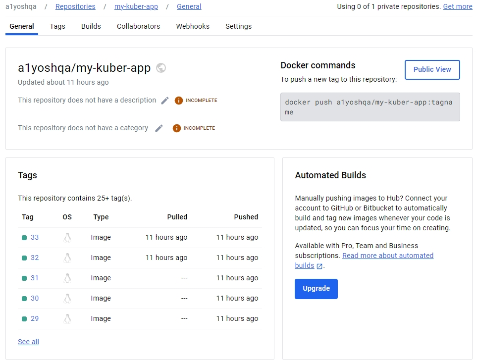
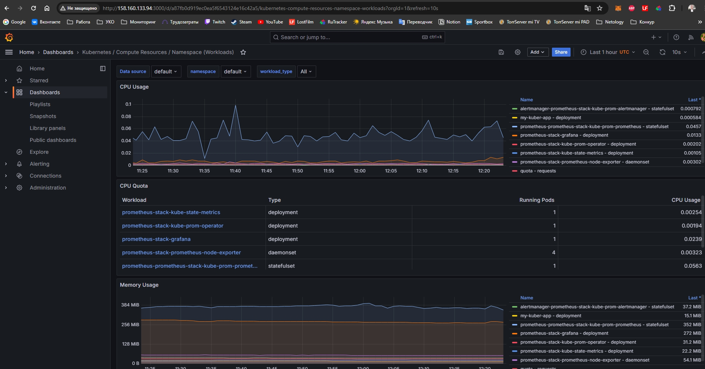
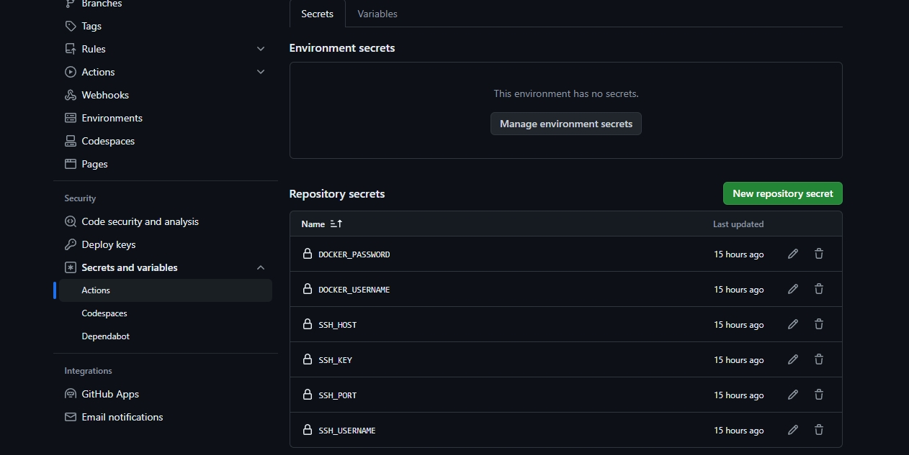
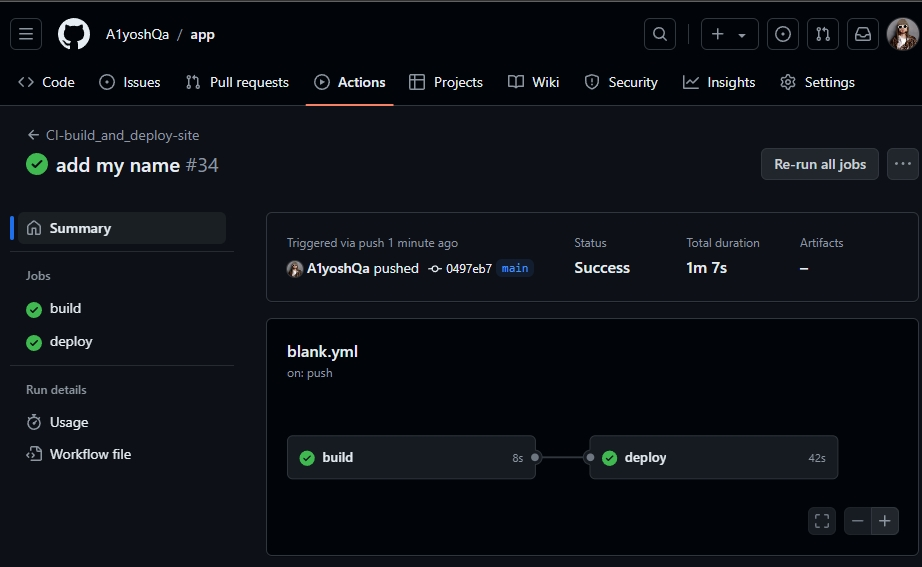
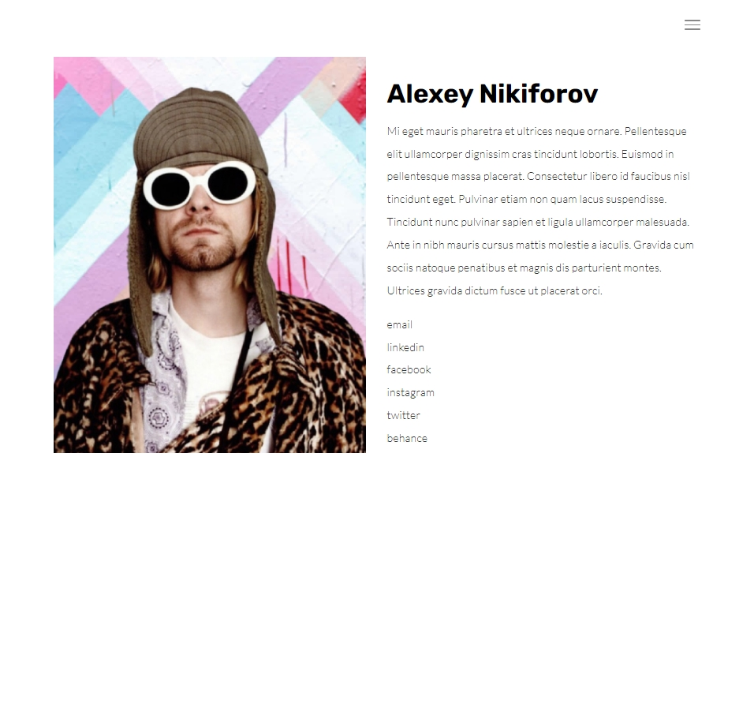

# Дипломный практикум в Yandex.Cloud
  * [Цели:](#цели)
  * [Этапы выполнения:](#этапы-выполнения)
     * [Создание облачной инфраструктуры](#создание-облачной-инфраструктуры)
     * [Создание Kubernetes кластера](#создание-kubernetes-кластера)
     * [Создание тестового приложения](#создание-тестового-приложения)
     * [Подготовка cистемы мониторинга и деплой приложения](#подготовка-cистемы-мониторинга-и-деплой-приложения)
     * [Установка и настройка CI/CD](#установка-и-настройка-cicd)
  * [Что необходимо для сдачи задания?](#что-необходимо-для-сдачи-задания)
  * [Как правильно задавать вопросы дипломному руководителю?](#как-правильно-задавать-вопросы-дипломному-руководителю)

**Перед началом работы над дипломным заданием изучите [Инструкция по экономии облачных ресурсов](https://github.com/netology-code/devops-materials/blob/master/cloudwork.MD).**

---
## Цели:

1. Подготовить облачную инфраструктуру на базе облачного провайдера Яндекс.Облако.
2. Запустить и сконфигурировать Kubernetes кластер.
3. Установить и настроить систему мониторинга.
4. Настроить и автоматизировать сборку тестового приложения с использованием Docker-контейнеров.
5. Настроить CI для автоматической сборки и тестирования.
6. Настроить CD для автоматического развёртывания приложения.

---
## Этапы выполнения:


<details><summary>Создание облачной инфраструктуры</summary>

   1. Создание сервисного аккаунта и подготовка бакета для хранения стейт файлов terraform [тык](./bucket/bucket.tf).
   2. Создание VPC с подсетями в разных зонах доступности [тык](./terraform/networks.tf)
   3. Результат создания облачной инфраструктуры три воркер ноды и одна мастер нода
```
terraform apply
Apply complete! Resources: 16 added, 0 changed, 0 destroyed.

Outputs:

external_ip_control_plane = "62.84.116.224"
external_ip_nodes = tolist([
  "158.160.52.75",
  "62.84.121.132",
  "158.160.131.149",
])
```
   4. Проверяем содержимое полученного файла hosts.yml сгенерированного при помощи темплейта для создание кубернетис кластера постедством **kubespray**.

```
---
all:
  hosts:
    control-plane:
      ansible_host: 62.84.116.224
      ansible_user: ubuntu
    node-1:
      ansible_host: 158.160.114.59
      ansible_user: ubuntu
    node-2:
      ansible_host: 84.201.143.218
      ansible_user: ubuntu
    node-3:
      ansible_host: 158.160.152.9
      ansible_user: ubuntu
  children:
    kube_control_plane:
      hosts:
        control-plane:
    kube_node:
      hosts:
        node-1:
        node-2:
        node-3:
    etcd:
      hosts:
        control-plane:
    k8s_cluster:
      vars:
        supplementary_addresses_in_ssl_keys: [62.84.116.224]
      children:
        kube_control_plane:
        kube_node:
    calico_rr:
      hosts: {}

```

</details>

---
<details><summary>Создание Kubernetes кластера</summary>

   1. Подготавливаем Kubespray.
```
$ git clone https://github.com/kubernetes-sigs/kubespray
$ sudo pip3 install -r requirements.txt
```
   2. Запускаем плейбук на основе инвентори [hosts.yml](./kubespray/inventory/my-k8s-cluster/hosts.yml) полученного при развертывании инфраструктуры терраформом на предыдущем этапе.
```
$ ansible-playbook -i inventory/my-k8s-cluster/hosts.yml --become --become-user=root cluster.yml
```   
   3. Подключаемся к мастеру и копируем содержимое файла (меняя ip на внешний ip мастер ноды) /etc/kubernetes/admin.conf на нашу рабочую машину.
```
apiVersion: v1
clusters:
- cluster:
    certificate-authority-data: LS0tLS1CRUdJTiBDRV...DQVRFLS0tLS0K
    server: https://127.0.0.1:6443
  name: cluster.local
contexts:
- context:
    cluster: cluster.local
    user: kubernetes-admin
  name: kubernetes-admin@cluster.local
current-context: kubernetes-admin@cluster.local
kind: Config
preferences: {}
users:
- name: kubernetes-admin
  user:
    client-certificate-data: LS0tLS1CRUdJTiBDRVJU...lDQVRFLS0tLS0K
    client-key-data: LS0tLS1CRUdJTiBSU0...RFIEtFWS0tLS0tCg==
```
   4. Проверяем доступность кластера.
```
root@my-ubuntu:/home/alyoshqa# kubectl get nodes
NAME            STATUS   ROLES           AGE     VERSION
control-plane   Ready    control-plane   2d23h   v1.29.5
node-1          Ready    <none>          2d23h   v1.29.5
node-2          Ready    <none>          2d23h   v1.29.5
node-3          Ready    <none>          2d23h   v1.29.5
```

```
root@my-ubuntu:/home/alyoshqa# kubectl get pods --all-namespaces
NAMESPACE     NAME                                                     READY   STATUS    RESTARTS        AGE
default       alertmanager-prometheus-stack-kube-prom-alertmanager-0   2/2     Running   6 (168m ago)    2d22h
default       my-kuber-app-745dcd885d-5k9vm                            1/1     Running   1 (153m ago)    10h
default       my-kuber-app-745dcd885d-dlh7s                            1/1     Running   1 (93m ago)     10h
default       my-kuber-app-745dcd885d-hg8d6                            1/1     Running   1 (168m ago)    10h
default       prometheus-prometheus-stack-kube-prom-prometheus-0       2/2     Running   6 (153m ago)    2d22h
default       prometheus-stack-grafana-5976f5cdf4-vdd2m                3/3     Running   9 (93m ago)     2d22h
default       prometheus-stack-kube-prom-operator-7f8785949b-kkgnd     1/1     Running   3 (168m ago)    2d22h
default       prometheus-stack-kube-state-metrics-58575d877f-gpjlj     1/1     Running   7 (151m ago)    2d22h
default       prometheus-stack-prometheus-node-exporter-552qx          1/1     Running   3 (168m ago)    2d22h
default       prometheus-stack-prometheus-node-exporter-572hp          1/1     Running   3 (153m ago)    2d22h
default       prometheus-stack-prometheus-node-exporter-bk4j6          1/1     Running   0               2d22h
default       prometheus-stack-prometheus-node-exporter-lgv46          1/1     Running   3 (93m ago)     2d22h
kube-system   calico-kube-controllers-68485cbf9c-qzmgn                 1/1     Running   3 (93m ago)     2d23h
kube-system   calico-node-dwh96                                        1/1     Running   14 (14m ago)    2d23h
kube-system   calico-node-hmcnr                                        1/1     Running   13 (153m ago)   2d23h
kube-system   calico-node-qbmjx                                        1/1     Running   12 (92m ago)    2d23h
kube-system   calico-node-xmn4l                                        1/1     Running   14 (168m ago)   2d23h
kube-system   coredns-69db55dd76-6tm82                                 1/1     Running   3 (168m ago)    2d23h
kube-system   coredns-69db55dd76-krdmm                                 1/1     Running   0               2d23h
kube-system   dns-autoscaler-6f4b597d8c-jg7vl                          1/1     Running   0               2d23h
kube-system   kube-apiserver-control-plane                             1/1     Running   1               2d23h
kube-system   kube-controller-manager-control-plane                    1/1     Running   18 (12m ago)    2d23h
kube-system   kube-proxy-8j8rv                                         1/1     Running   3 (93m ago)     2d23h
kube-system   kube-proxy-d659q                                         1/1     Running   3 (153m ago)    2d23h
kube-system   kube-proxy-kmqcp                                         1/1     Running   3 (168m ago)    2d23h
kube-system   kube-proxy-n54pf                                         1/1     Running   0               2d23h
kube-system   kube-scheduler-control-plane                             1/1     Running   18 (12m ago)    2d23h
kube-system   nginx-proxy-node-1                                       1/1     Running   3 (93m ago)     2d23h
kube-system   nginx-proxy-node-2                                       1/1     Running   3 (153m ago)    2d23h
kube-system   nginx-proxy-node-3                                       1/1     Running   3 (168m ago)    2d23h
kube-system   nodelocaldns-jkxpg                                       1/1     Running   7 (168m ago)    2d23h
kube-system   nodelocaldns-lc7wf                                       1/1     Running   0               2d23h
kube-system   nodelocaldns-vpm5m                                       1/1     Running   3 (153m ago)    2d23h
kube-system   nodelocaldns-vtvkx                                       1/1     Running   3 (93m ago)     2d23h
```


</details>

---
<details><summary>Создание тестового приложения</summary>

Создадим докер-образ на основе **nginx**, отдающим страницу-портфолио. [Репозиторий с исходниками](https://github.com/A1yoshQa/app.git).

   1.  [Dockerfile](https://github.com/A1yoshQa/app/blob/main/Dockerfile)
   2.  [Конфиг nginx](https://github.com/A1yoshQa/app/blob/main/nginx/app.conf)
   3.  В качесиве регистри был использован [DockerHub](https://hub.docker.com/repository/docker/a1yoshqa/my-kuber-app/general) 
   
   4. Для развертывания приложения в кластере созданы файлы deployment.yml, service.yml.
```
---
apiVersion: apps/v1
kind: Deployment
metadata:
  name: my-kuber-app
spec:
  replicas: 3
  selector:
    matchLabels:
      app: my-kuber-app
  template:
    metadata:
      labels:
        app: my-kuber-app
    spec:
      containers:
        - name: my-kuber-app
          image: a1yoshqa/my-kuber-app:{{image_tag}}
          ports:
            - name: http
              containerPort: 80
              protocol: TCP
```

```
---
apiVersion: v1
kind: Service
metadata:
  name: my-kuber-app-svc
spec:
  type: NodePort
  selector:
    app: my-kuber-app
  ports:
    - name: web
      nodePort: 30903
      port: 80
      targetPort: 80
```
   5. В конфигурацию терраформа был добавлен код сетевого балансировщика для приложения
```
resource "yandex_lb_network_load_balancer" "nlb-my-k8s-app" {

  name = "nlb-my-k8s-app"

  listener {
    name        = "app-listener"
    port        = 80
    target_port = 30903
    external_address_spec {
      ip_version = "ipv4"
    }
  }
```


</details>


---
<details><summary>Подготовка cистемы мониторинга и деплой приложения</summary>

   1. Для разворачивания мониторинга воспользуемся helm [чартом](https://github.com/prometheus-community/helm-charts/tree/main/charts/kube-prometheus-stack)

```
helm repo add prometheus-community https://prometheus-community.github.io/helm-charts
helm repo update
helm install prometheus-stack  prometheus-community/kube-prometheus-stack
```
   2. Проверим поднятие мониторинга

```
root@my-ubuntu:/home/alyoshqa# kubectl get svc -w
NAME                                        TYPE        CLUSTER-IP      EXTERNAL-IP   PORT(S)                      AGE
alertmanager-operated                       ClusterIP   None            <none>        9093/TCP,9094/TCP,9094/UDP   2d23h
grafana                                     NodePort    10.233.24.218   <none>        3000:30902/TCP               2d23h
kubernetes                                  ClusterIP   10.233.0.1      <none>        443/TCP                      3d
my-kuber-app-svc                            NodePort    10.233.14.116   <none>        80:30903/TCP                 11h
prometheus-operated                         ClusterIP   None            <none>        9090/TCP                     2d23h
prometheus-stack-grafana                    ClusterIP   10.233.8.150    <none>        80/TCP                       2d23h
prometheus-stack-kube-prom-alertmanager     ClusterIP   10.233.17.151   <none>        9093/TCP,8080/TCP            2d23h
prometheus-stack-kube-prom-operator         ClusterIP   10.233.3.97     <none>        443/TCP                      2d23h
prometheus-stack-kube-prom-prometheus       ClusterIP   10.233.15.234   <none>        9090/TCP,8080/TCP            2d23h
prometheus-stack-kube-state-metrics         ClusterIP   10.233.63.159   <none>        8080/TCP                     2d23h
prometheus-stack-prometheus-node-exporter   ClusterIP   10.233.27.68    <none>        9100/TCP                     2d23h
```

   3. Создадим манифест серсива NodePort для Grafana

```
---
apiVersion: v1
kind: Service
metadata:
  name: grafana
spec:
  type: NodePort
  selector:
    app.kubernetes.io/name: grafana
  ports:
    - name: http
      nodePort: 30902
      port: 3000
      targetPort: 3000
```

   4. Для доступа извне добавим блок терраформа с сетевым балансировщиком для апп и графаны.

```
resource "yandex_lb_target_group" "nlb-group-grafana" {

  name       = "nlb-group-grafana"
  depends_on = [yandex_compute_instance_group.k8s-node-group]

  dynamic "target" {
    for_each = yandex_compute_instance_group.k8s-node-group.instances
    content {
      subnet_id = target.value.network_interface.0.subnet_id
      address   = target.value.network_interface.0.ip_address
    }
  }
}

resource "yandex_lb_network_load_balancer" "nlb-graf" {

  name = "nlb-grafana"

  listener {
    name        = "grafana-listener"
    port        = 3000
    target_port = 30902
    external_address_spec {
      ip_version = "ipv4"
    }
  }

  attached_target_group {
    target_group_id = yandex_lb_target_group.nlb-group-grafana.id

    healthcheck {
      name = "healthcheck"
      tcp_options {
        port = 30902
      }
    }
  }
  depends_on = [yandex_lb_target_group.nlb-group-grafana]
}

resource "yandex_lb_network_load_balancer" "nlb-appl" {

  name = "nlb-my-k8s-app"

  listener {
    name        = "app-listener"
    port        = 80
    target_port = 30903
    external_address_spec {
      ip_version = "ipv4"
    }
  }

  attached_target_group {
    target_group_id = yandex_lb_target_group.nlb-group-grafana.id

    healthcheck {
      name = "healthcheck"
      tcp_options {
        port = 30903
      }
    }
  }
  depends_on = [yandex_lb_target_group.nlb-group-grafana]
}
```

   5. Проверим доступность




   [ССЫЛКА НА ГРАФАНУ](http://158.160.133.94:3000/) 

   [ССЫЛКА НА САЙТ](http://158.160.146.168/) (внешний Ip loadbalancer'а раскидывающий трафик по 3 воркерам)


</details>


---
<details><summary>Установка и настройка CI/CD</summary>
   Для создания пайплайна для сборки и деплоя приложения выбран GitHub Actions.

   [Ссылка на репозиторий](https://github.com/A1yoshQa/app.git)

   1. [Ссылка манифест ci/cd](https://github.com/A1yoshQa/app/blob/main/.github/workflows/blank.yml) 
   2. Секреты и прочие переменные используемые в сборке создаются в веб интерфейсе графаны

   3. В процессе сборки образ создаётся на основе [Dockerfile](https://github.com/A1yoshQa/app/blob/main/Dockerfile) представленного раннее, деплой осуществляется путём создания объектов кубера в клстере на основе манифестов [deployment.yaml](https://github.com/A1yoshQa/app/blob/main/kuber/deployment.yaml) и [service.yaml](https://github.com/A1yoshQa/app/blob/main/kuber/service.yaml).
   4. Сам манифест сборки предстален ниже, и также расположен по стандартному пути /.github/workflows
```
name: CI-build_and_deploy-site

env:
  IMAGE_NAME: ${{ secrets.DOCKER_USERNAME }}/my-kuber-app
  TAG: ${{ github.run_number }}
  FILE_TAG: ./environments/value_tag
  VARS_APP_REPO: ${{ vars.APP_REPO }}
  REPO_DIR: app
  
on:
  push:
    branches:
    - main
    tags:
    - '*'
    
jobs:

  build:
    outputs:
      image_tag: ${{ env.TAG }}
    runs-on: ubuntu-latest

    steps:
    
    - name: Get files
      uses: actions/checkout@v3

    - name: Set env TAG
      id: step_tag
      run: echo "TAG=$(echo ${GITHUB_REF:10})" >> $GITHUB_ENV
      if: startsWith(github.ref, 'refs/tags/v')
      
    - name: Build the Docker image
      run: docker build . --file Dockerfile --tag ${{ env.IMAGE_NAME }}:${{ env.TAG }}
    
    - name: Push the Docker image
      run: |
        docker login --username ${{ secrets.DOCKER_USERNAME }} --password ${{ secrets.DOCKER_PASSWORD }}
        docker push ${{ env.IMAGE_NAME }}:${{ env.TAG }}


  deploy: 
    
    needs: build
    runs-on: ubuntu-latest

    steps:

    - name: Update application
      env:
        tag: ${{ needs.build.outputs.image_tag }}
      uses: appleboy/ssh-action@v1.0.3
      with:
        host: ${{ secrets.SSH_HOST }}
        username: ${{ secrets.SSH_USERNAME }}
        key: ${{ secrets.SSH_KEY }}
        port: ${{ secrets.SSH_PORT }}
        script: |
          sudo su 
          sudo apt install git -y
          kubectl delete  -f .app/kuber/deployment.yaml
          kubectl delete -f .app/kuber/service.yaml
          rm -rf ./${{ env.REPO_DIR}}
          git clone ${{ env.VARS_APP_REPO }} ./${{ env.REPO_DIR}}
          cd ./${{ env.REPO_DIR}}
          sed -i "s|{{image_tag}}|${{ env.tag }}|g" ./kuber/deployment.yaml
          sudo kubectl apply -f ./kuber/deployment.yaml
          sudo kubectl apply -f ./kuber/service.yaml
          sudo kubectl get po,svc | grep my-kuber-app
```

   5. Немного персонализируем наш сайт и выполним пуш комита.

```
root@my-ubuntu:/home/alyoshqa/app# git add .
root@my-ubuntu:/home/alyoshqa/app# git commit -m "add my name"
[main 0497eb7] add my name
 1 file changed, 2 insertions(+), 2 deletions(-)
root@my-ubuntu:/home/alyoshqa/app# git push -u origin
Enumerating objects: 7, done.
Counting objects: 100% (7/7), done.
Delta compression using up to 4 threads
Compressing objects: 100% (4/4), done.
Writing objects: 100% (4/4), 401 bytes | 401.00 KiB/s, done.
Total 4 (delta 3), reused 0 (delta 0), pack-reused 0
remote: Resolving deltas: 100% (3/3), completed with 3 local objects.
To https://github.com/A1yoshQa/app.git
   247522a..0497eb7  main -> main
Branch 'main' set up to track remote branch 'main' from 'origin'.
```

   6. Проверим статус сборки

сборка прошла успешно

   7. Проверим обновилась ли статика нашего сайта
   
   
   успешно


</details>

---
## Материалы необходимые для сдачи задания

1. [Репозиторий с конфигурационными файлами Terraform](https://github.com/A1yoshQa/netology/tree/main/diplom/terraform).
2. [Репозиторий с конфигурацией kubespray](https://github.com/kubernetes-sigs/kubespray).
3. [Репозиторий с Dockerfile тестового приложения](https://github.com/A1yoshQa/app.git) и [ссылка на собранный docker image](https://hub.docker.com/repository/docker/a1yoshqa/my-kuber-app/general).
4. [Успешная джоба](https://github.com/A1yoshQa/app/actions/runs/9436664803) 
5. [Ссылка на тестовое приложение](http://158.160.146.168/) и [веб интерфейс Grafana](http://158.160.133.94:3000/) с данными доступа.

   - login admin
   - pass yourNewPasswordHere


