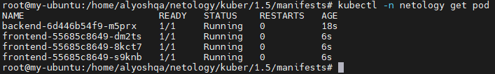

# Домашнее задание к занятию «Сетевое взаимодействие в K8S. Часть 2»

### Инструменты и дополнительные материалы, которые пригодятся для выполнения задания

1. [Инструкция](https://microk8s.io/docs/getting-started) по установке MicroK8S.
2. [Описание](https://kubernetes.io/docs/concepts/services-networking/service/) Service.
3. [Описание](https://kubernetes.io/docs/concepts/services-networking/ingress/) Ingress.
4. [Описание](https://github.com/wbitt/Network-MultiTool) Multitool.

---

### Задание 1. Создать Deployment приложений backend и frontend

1. Создать Deployment приложения _frontend_ из образа nginx с количеством реплик 3 шт.
2. Создать Deployment приложения _backend_ из образа multitool.

3. Добавить Service, которые обеспечат доступ к обоим приложениям внутри кластера.

4. Продемонстрировать, что приложения видят друг друга с помощью Service.

5. Предоставить манифесты Deployment и Service в решении, а также скриншоты или вывод команды п.4.

[deployment & service > backend](./manifests/backend.yaml)

[deployment & service > frontend](./manifests/frontend.yaml)

---

### Задание 2. Создать Ingress и обеспечить доступ к приложениям снаружи кластера

1. Включить Ingress-controller в MicroK8S.

2. Создать Ingress, обеспечивающий доступ снаружи по IP-адресу кластера MicroK8S так, чтобы при запросе только по адресу открывался _frontend_ а при добавлении /api - _backend_.

3. Продемонстрировать доступ с помощью браузера или `curl` с локального компьютера.

4. Предоставить манифесты и скриншоты или вывод команды п.2.

[ingress](./manifests/ingress.yaml)

---

### Правила приема работы

1. Домашняя работа оформляется в своем Git-репозитории в файле README.md. Выполненное домашнее задание пришлите ссылкой на .md-файл в вашем репозитории.
2. Файл README.md должен содержать скриншоты вывода необходимых команд `kubectl` и скриншоты результатов.
3. Репозиторий должен содержать тексты манифестов или ссылки на них в файле README.md.

---
