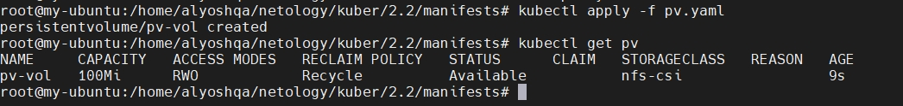
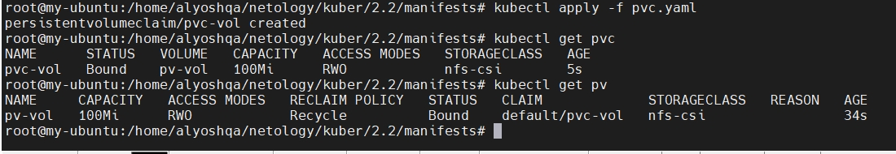
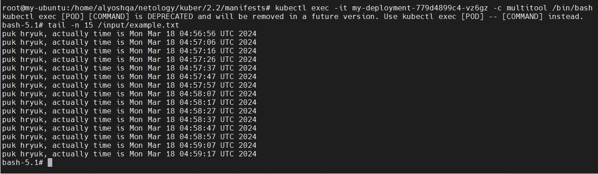
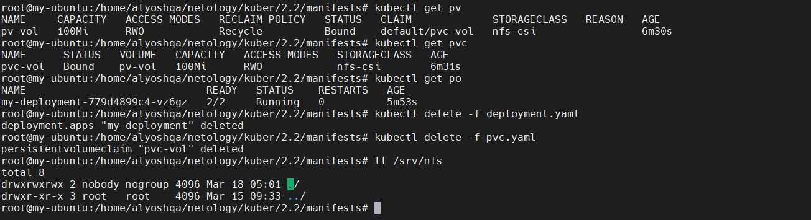
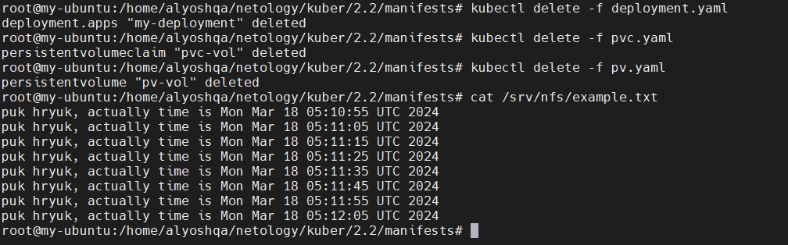
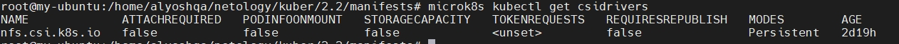
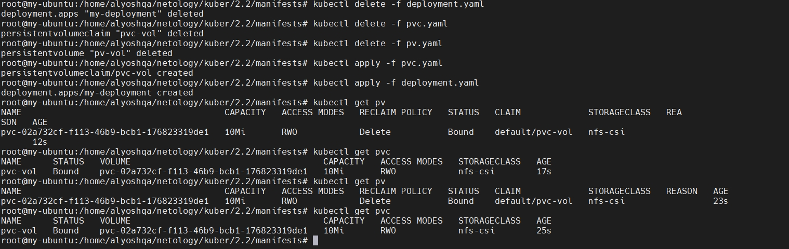

# Домашнее задание к занятию «Хранение в K8s. Часть 2»

### Задание 1

**Что нужно сделать**

Создать Deployment приложения, использующего локальный PV, созданный вручную.

1. Создать Deployment приложения, состоящего из контейнеров busybox и multitool.
2. Создать PV и PVC для подключения папки на локальной ноде, которая будет использована в поде.

3. Продемонстрировать, что multitool может читать файл, в который busybox пишет каждые пять секунд в общей директории.

4. Удалить Deployment и PVC. Продемонстрировать, что после этого произошло с PV. Пояснить, почему.

`Параметр persistentVolumeReclaimPolicy: Recycle - файл удалился с ноды, после удаления deployment и pvc.`

5. Продемонстрировать, что файл сохранился на локальном диске ноды. Удалить PV. Продемонстрировать что произошло с файлом после удаления PV. Пояснить, почему.

`После изменения параметра persistentVolumeReclaimPolicy: Recycle -> Retain, файлы остались на хосте после удаления deployment и pvc`

5. Предоставить манифесты, а также скриншоты или вывод необходимых команд.

[deployment.yaml](./manifests/deployment.yaml)

[pv.yaml](./manifests/pv.yaml)

[pvc.yaml](./manifests/pvc.yaml)

---

### Задание 2

**Что нужно сделать**

Создать Deployment приложения, которое может хранить файлы на NFS с динамическим созданием PV.

1. Включить и настроить NFS-сервер на MicroK8S.

2. Создать Deployment приложения состоящего из multitool, и подключить к нему PV, созданный автоматически на сервере NFS.

3. Продемонстрировать возможность чтения и записи файла изнутри пода.

4. Предоставить манифесты, а также скриншоты или вывод необходимых команд.

[sc-nfs.yaml](./manifests/sc-nfs.yaml)

---
