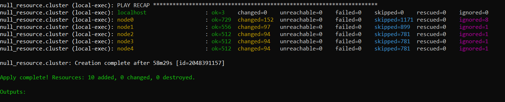
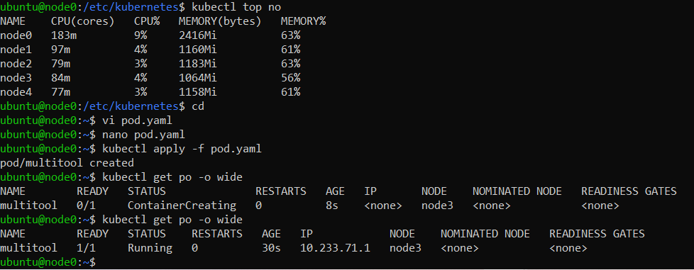
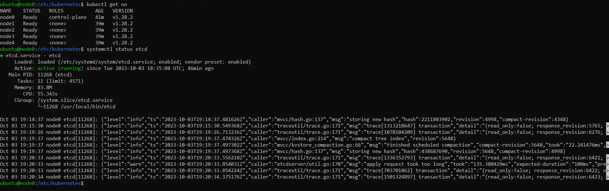

# Домашнее задание к занятию «Установка Kubernetes»

### Цель задания

Установить кластер K8s.

### Чеклист готовности к домашнему заданию

1. Развёрнутые ВМ с ОС Ubuntu 20.04-lts.


### Инструменты и дополнительные материалы, которые пригодятся для выполнения задания

1. [Инструкция по установке kubeadm](https://kubernetes.io/docs/setup/production-environment/tools/kubeadm/create-cluster-kubeadm/).
2. [Документация kubespray](https://kubespray.io/).

-----

### Задание 1. Установить кластер k8s с 1 master node

1. Подготовка работы кластера из 5 нод: 1 мастер и 4 рабочие ноды.
2. В качестве CRI — containerd.
3. Запуск etcd производить на мастере.
4. Способ установки выбрать самостоятельно.

## Ответ:
Установка через kubespray:
```
git clone https://github.com/kubernetes-sigs/kubespray.git
mv kubespray ~/netology-devops-kuber-homeworks/3.2
cd ~/netology-devops-kuber-homeworks/3.2/kubespray
pip install -r requirements.txt
cd ../terraform/
terraform plan
terraform apply
```
Папка kubespray/roles была перенесена в папку kubespray/playbooks/roles <br />


