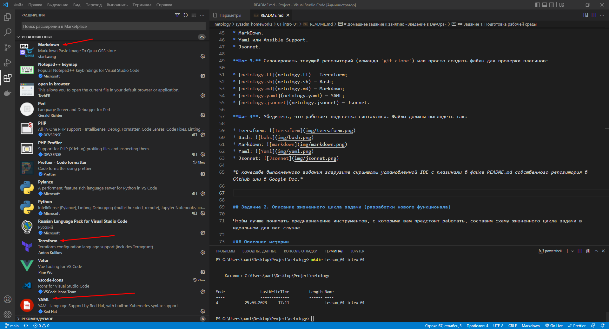
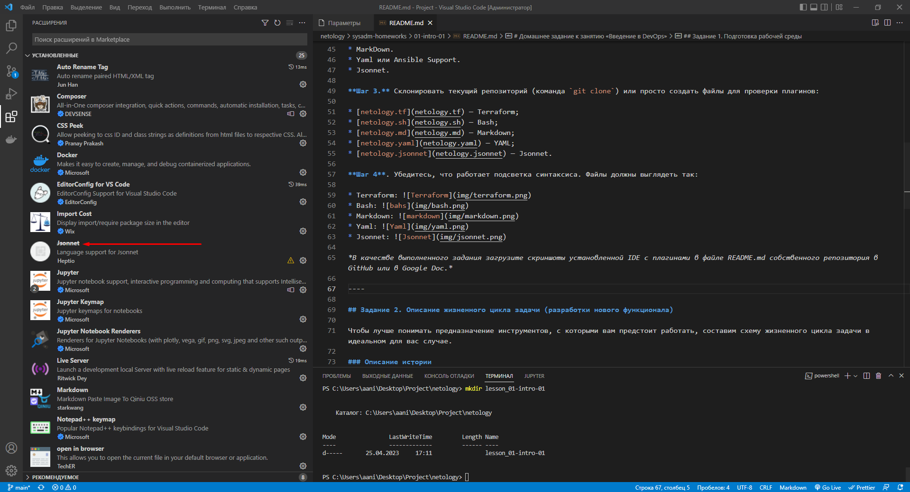

## Задание 1. Подготовка рабочей среды

В качестве выполненного задания загрузите скриншоты установленной IDE с плагинами в файле README.md собственного репозитория в GitHub или в Google Doc.

- Screen1 
- Screen2 

## Задание 2. Описание жизненного цикла задачи (разработки нового функционала)

Вам нужно описать процесс решения задачи в соответствии с жизненным циклом разработки программного обеспечения. Использование конкретного метода разработки необязательно.

Для решения главное — прописать по пунктам шаги решения задачи (релизации в конечный результат) с участием менеджера, разработчика (или команды разработчиков), тестировщика (или команды тестировщиков) и себя как DevOps-инженера.

1. Менеджер (ПМ) формулирует какую цель преследует данное обновление, нарезает задачи
2. Разработчики пишут код
3. Тестировщики пишут тесты
4. Готовый код пушат в дев ветку системы хранения репозиториев (gitlab)
5. Я как DevOps запускаю ci/cd с доставкой на тестовый контур
6. На тесте ПМ смотрит что получилось, если все цели достигнуты - мерджим в main, (собираем если есть отличия от сборки на тесте) планируем дату переноса в прод
7. Переносим в прод
