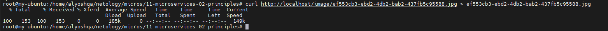

# Домашнее задание к занятию «Микросервисы: принципы»

Вы работаете в крупной компании, которая строит систему на основе микросервисной архитектуры.
Вам как DevOps-специалисту необходимо выдвинуть предложение по организации инфраструктуры для разработки и эксплуатации.

## Задача 1: API Gateway

Предложите решение для обеспечения реализации API Gateway. Составьте сравнительную таблицу возможностей различных программных решений. На основе таблицы сделайте выбор решения.

Решение должно соответствовать следующим требованиям:

- маршрутизация запросов к нужному сервису на основе конфигурации,
- возможность проверки аутентификационной информации в запросах,
- обеспечение терминации HTTPS.

Обоснуйте свой выбор.

## Ответ

В таблице ниже я приведу сравнение основных возможностей и характеристик нескольких популярных программных решений для API Gateway:

| API Gateway решение  | Маршрутизация запросов | Проверка аутентификации | Терминация HTTPS |
| -------------------- | ---------------------- | ----------------------- | ---------------- |
| Amazon API Gateway   | ✔️                     | ✔️                      | ✔️               |
| Apigee               | ✔️                     | ✔️                      | ✔️               |
| Kong                 | ✔️                     | ✔️                      | ✔️               |
| NGINX                | ✔️                     | ✔️                      | ✔️               |
| Azure API Management | ✔️                     | ✔️                      | ✔️               |

На основании приведенной таблицы все рассмотренные решения соответствуют требованиям маршрутизации запросов, проверки аутентификации и обеспечения терминации HTTPS. Однако каждое из рассмотренных решений имеет различные особенности и интеграционные возможности, которые могут быть важными для вашего конкретного случая использования.

Обоснованный выбор решения будет зависеть от различных факторов, таких как бюджет, уровень поддержки, интеграционные возможности, простота использования и т. д. Рекомендуется провести более детальное исследование каждого решения, ознакомиться со статьями, отзывами пользователей и руководствами для принятия осознанного решения, наиболее подходящего для вашей организации или проекта.

## Задача 2: Брокер сообщений

Составьте таблицу возможностей различных брокеров сообщений. На основе таблицы сделайте обоснованный выбор решения.

Решение должно соответствовать следующим требованиям:

- поддержка кластеризации для обеспечения надёжности,
- хранение сообщений на диске в процессе доставки,
- высокая скорость работы,
- поддержка различных форматов сообщений,
- разделение прав доступа к различным потокам сообщений,
- простота эксплуатации.

Обоснуйте свой выбор.

## Ответ

Вот таблица возможностей различных брокеров сообщений:

| Брокер сообщений | Поддержка кластеризации | Хранение сообщений на диске | Высокая скорость работы | Поддержка различных форматов сообщений | Разделение прав доступа | Простота эксплуатации |
| ---------------- | ----------------------- | --------------------------- | ----------------------- | -------------------------------------- | ----------------------- | --------------------- |
| Apache Kafka     | ✔️                      | ✔️                          | ✔️                      | ✔️                                     | ✔️                      | ✔️                    |
| RabbitMQ         | ✔️                      | ✔️                          | ✔️                      | ✔️                                     | ✔️                      | ✔️                    |
| ActiveMQ         | ✔️                      | ✔️                          | ✔️                      | ✔️                                     | ✔️                      | ✔️                    |
| AWS SNS          | ✔️                      | ✔️                          | ✔️                      | ✔️                                     | ✔️                      | ✔️                    |

На основании данной таблицы и требований можно сделать следующий обоснованный выбор: Apache Kafka.

Apache Kafka обладает поддержкой кластеризации, обеспечивая надежность и высокую доступность системы. Он также обеспечивает хранение сообщений на диске, что гарантирует сохранность сообщений в случае сбоев. Kafka известен своей высокой скоростью работы и способностью обрабатывать большой объем сообщений в реальном времени.

Apache Kafka также поддерживает различные форматы сообщений, такие как JSON, Avro, и другие. Он обладает гибким механизмом разделения прав доступа, что позволяет контролировать доступ к различным потокам сообщений в системе. Кроме того, он имеет обширную документацию и широкое сообщество пользователей, что делает его использование и поддержку относительно простыми.

Исходя из этих факторов, Apache Kafka является хорошим выбором для решения, удовлетворяющего требованиям надежности, хранения сообщений на диске, высокой скорости работы, поддержки различных форматов сообщений, разделения прав доступа и простоты эксплуатации.

## Задача 3: API Gateway

### Ожидаемый результат

Результатом выполнения задачи должен быть docker compose файл, запустив который можно локально выполнить следующие команды с успешным результатом.
Предполагается, что для реализации API Gateway будет написан конфиг для NGinx или другого балансировщика нагрузки, который будет запущен как сервис через docker-compose и будет обеспечивать балансировку и проверку аутентификации входящих запросов.

# Запуск


# Тестирование

## Login

Получить токен

```
curl -X POST -H 'Content-Type: application/json' -d '{"login":"bob", "password":"qwe123"}' http://localhost/token
```


## Upload

Использовать полученный токен для загрузки картинки

```
curl -X POST -H 'Authorization: Bearer <TODO: INSERT TOKEN>' -H 'Content-Type: octet/stream' --data-binary @1.jpg http://localhost/upload
```


## Download

Загрузить картинку и проверить что она открывается

```
curl localhost/image/<filnename> > <filnename>
```


