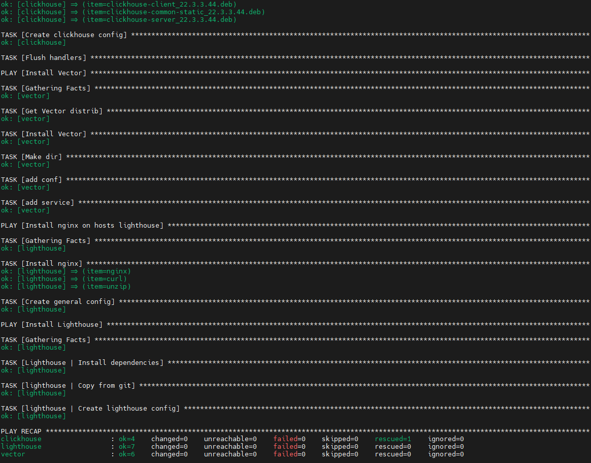
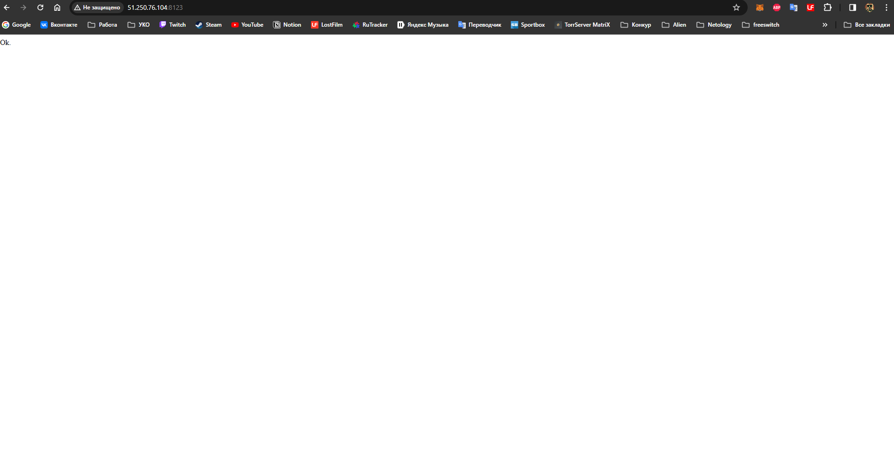
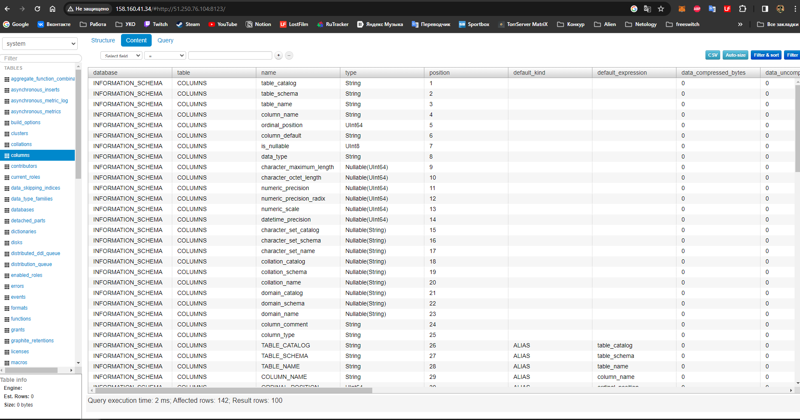

# Домашнее задание к занятию 2 «Работа с Playbook»

## Demonstration of work





## List of instructions performed in the playbook

1. Creating a directory for ssh keys.
2. Adding an rsa key to the file "/root/.ssh/authorized_keys".
3. Download the Clickhouse distribution using the URL and save it in the created VM.
4. If downloading Clickhouse fails, download clickhouse-common-static distribution.
5. Installing Clickhouse from previously downloaded distributions.
6. Creating a database in Clickhouse.
7. Loading a Vector distribution using a URL and saving it in the created VM.
8. Installing Vector from a previously downloaded distribution.
9. Creating the /etc/vector directory.
10. Adding a Vector configuration file to /etc/vector/vector.toml.
11. Adding the systemd Vector service to /etc/systemd/system/vector.service.
12. Launch of Clickhouse and Vector services.
13. Downloads the Lighthouse source code from a git repository specified in the variable lighthouse_vcs and ensures it is located at the directory specified in lighthouse_location_dir.
14. Creates a configuration file for nginx by rendering the template lighthouse.conf.j2 and saves it at /etc/nginx/conf.d/default.conf with permissions 0644.
15. Notifies the reload-nginx handler to reload the nginx service when the configuration file is created or updated.

# Playbook

This playbook is used to install Clickhouse, Vector and Lighthouse services on the specified host.

## Parameters

The playbook has the following parameters:

- `clickhouse_packages`: A list of Clickhouse packages to be installed. By default, it includes the `clickhouse-client`, `clickhouse-common-static`, and `clickhouse-server` packages. You can modify this list to include additional packages if needed.

- `clickhouse_version`: The version of Clickhouse to be installed. By default, it is set to the latest available version.

## Tags

The playbook uses the following tags:

- `clickhouse`: This tag is used to execute tasks related to Clickhouse installation and configuration.

- `vector`: This tag is used to execute tasks related to Vector installation and configuration.

- `lighthouse`: This tag is used to execute tasks related to Lighthouse installation and configuration.

## Handlers

The playbook includes the following handlers:

- `Start clickhouse service`: This handler is responsible for starting the Clickhouse service after installation or configuration changes.

- `Start vector service`: This handler is responsible for starting the Vector service after installation or configuration changes.

- `Start lighthouse service`: This handler is responsible for restarting the nginx when servers with Lighthouse service after installation or configuration changes.

## Tasks

The playbook consists of the following tasks:

1. Create directory for ssh-keys: This task creates a directory for storing SSH keys on the remote host.

2. Adding rsa-key in /root/.ssh/authorized_keys: This task copies the RSA public key to the authorized_keys file on the remote host, allowing SSH access.

3. Get clickhouse distrib: This task downloads the Clickhouse distribution packages from the Clickhouse repository. It tries to download the packages specified in the `clickhouse_packages` variable. If the download fails, it falls back to downloading the `clickhouse-common-static` package.

4. Install clickhouse: This task installs Clickhouse using the downloaded packages. It uses the `apt` module to install the packages specified in the `clickhouse_packages` variable. After installation, it notifies the `Start clickhouse service` handler to start the Clickhouse service.

5. Flush handlers: This task flushes all the handlers, ensuring that any pending handler tasks are executed.

6. Create database: This task uses the `ansible.builtin.command` module to run the Clickhouse client command and create a database named "logs". It registers the output of the command and handles failed and changed conditions.

7. Get Vector distrib: This task downloads the Vector distribution package from the Timber repository.

8. Install Vector: This task installs Vector using the downloaded package. It uses the `apt` module to install the package.

9. Make dir: This task creates a directory for storing Vector configuration files.

10. Add conf: This task uses the `template` module to add the Vector configuration file `vector.toml` in the `/etc/vector` directory.

11. Add service: This task uses the `template` module to add the Vector service file `vector.service` in the `/etc/systemd/system` directory. After installation, it notifies the `Start vector service` handler to start the Vector service.

12. Install nginx, curl, and unzip packages.

13. Create the general nginx configuration file for lightgouse service.

14. Download the Lighthouse source code from the specified git repository and location.

15. Notify the `reload-nginx` handler to reload the nginx service.

Note: The playbook assumes that the necessary template files are present in the `templates` directory relative to the playbook.

## How to Use

1. Update the variable with any additional packages you want to install.

2. Run the playbook using the following command:

   ```
   ansible-playbook -i inventory/prod.yml site.yml
   ```

   Replace `prod.yml` with your inventory file and `site.yml` with the name of your playbook file.

3. The playbook will install Clickhouse Vector, and Lighthouse services on the specified hosts. The services will be started automatically after installation or configuration changes.
