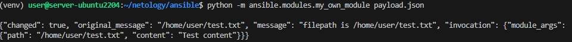
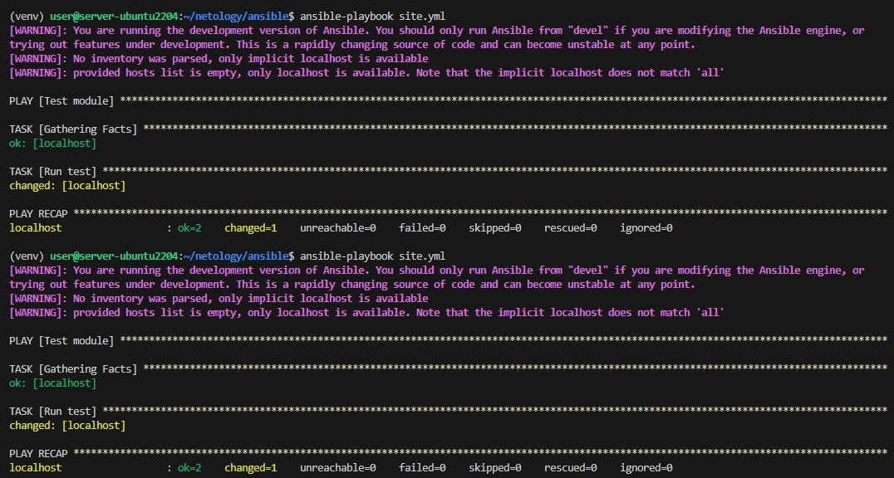
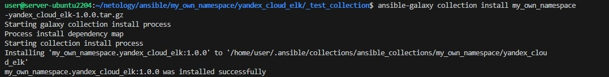
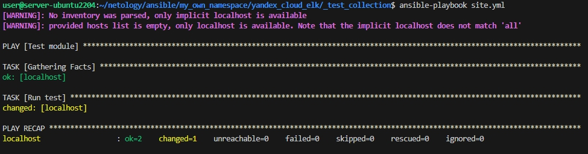

# Домашнее задание к занятию 6 «Создание собственных модулей»

## Основная часть

**Шаг 17.** В ответ необходимо прислать ссылки на collection и tar.gz архив, а также скриншоты выполнения пунктов 4, 6, 15 и 16.

**пункт 4**

**пункт 6**

**пункт 15**

**пункт 16**

