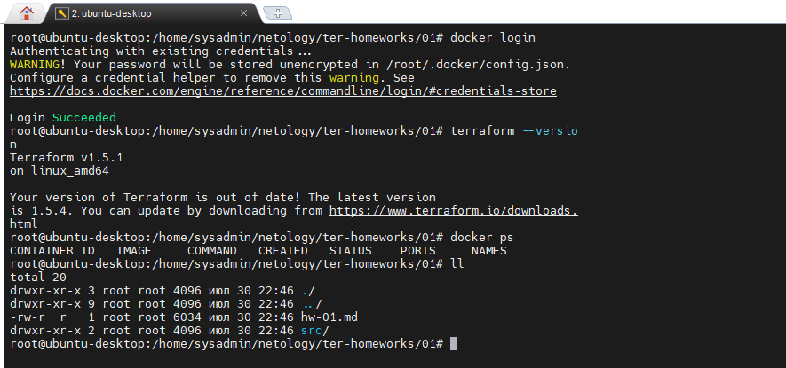
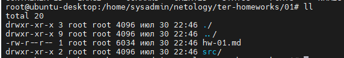
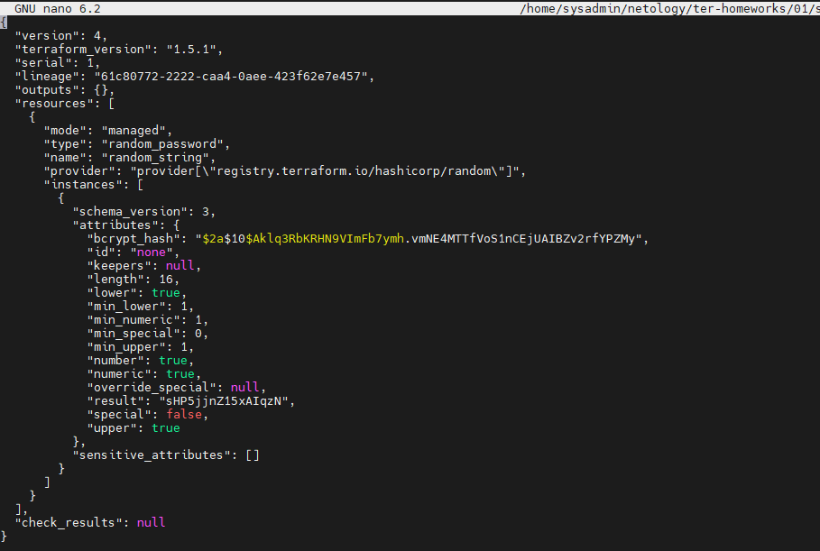
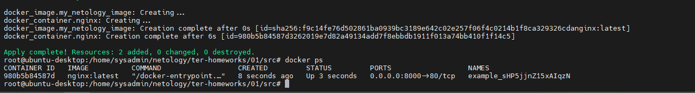
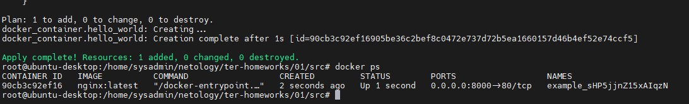
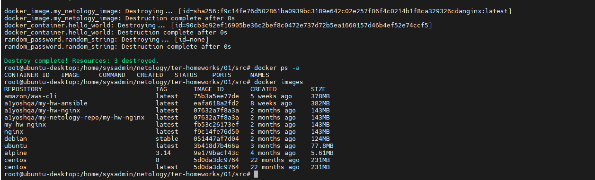

# Домашнее задание к занятию «Введение в Terraform»

### Чек-лист готовности к домашнему заданию

1. Скачайте и установите актуальную версию **Terraform** >=1.4.X . Приложите скриншот вывода команды `terraform --version`.
2. Скачайте на свой ПК этот git-репозиторий. Исходный код для выполнения задания расположен в директории **01/src**.
3. Убедитесь, что в вашей ОС установлен docker.
4. Зарегистрируйте аккаунт на сайте https://hub.docker.com/, выполните команду docker login и введите логин, пароль.

### Скриншот к чек-листу

## Screen1 

### Задание

1. Перейдите в каталог [**src**](https://github.com/netology-code/ter-homeworks/tree/main/01/src). Скачайте все необходимые зависимости, использованные в проекте.
2. Изучите файл **.gitignore**. В каком terraform-файле, согласно этому .gitignore, допустимо сохранить личную, секретную информацию?
3. Выполните код проекта. Найдите в state-файле секретное содержимое созданного ресурса **random_password**, пришлите в качестве ответа конкретный ключ и его значение.
4. Раскомментируйте блок кода, примерно расположенный на строчках 29–42 файла **main.tf**.
   Выполните команду `terraform validate`. Объясните, в чём заключаются намеренно допущенные ошибки. Исправьте их.
5. Выполните код. В качестве ответа приложите вывод команды `docker ps`.
6. Замените имя docker-контейнера в блоке кода на `hello_world`. Не перепутайте имя контейнера и имя образа. Мы всё ещё продолжаем использовать name = "nginx:latest". Выполните команду `terraform apply -auto-approve`.
   Объясните своими словами, в чём может быть опасность применения ключа `-auto-approve`. В качестве ответа дополнительно приложите вывод команды `docker ps`.
7. Уничтожьте созданные ресурсы с помощью **terraform**. Убедитесь, что все ресурсы удалены. Приложите содержимое файла **terraform.tfstate**.
8. Объясните, почему при этом не был удалён docker-образ **nginx:latest**. Ответ подкрепите выдержкой из документации [**провайдера docker**](https://docs.comcloud.xyz/providers/kreuzwerker/docker/latest/docs).

---

### Ответы на задание

1.  

2.  В файле personal.auto.tfvars
3.  

4.  Ошибка "Missing name for resource" означает, что в блоке ресурса не указано имя ресурса.

            Решение: resource "docker_image" "my_netology_image"

    Ошибка "Error: Invalid resource name" означает, что в коде Terraform на строке 29 задано недопустимое имя для ресурса `docker_container`.

        Решение: resource "docker_container" "nginx"

    Ошибка "Error: Unsupported attribute"

        Решение: example_${random_password.random_string.result}

    Ошибка "Error: Reference to undeclared resource"

        Решение: image = "nginx:latest"

5.  

6.  Ключ -auto-approve в команде terraform apply применяется для автоматического подтверждения всех изменений, предлагаемых Terraform. Он опасен тем, что может привести к необратимым действиям, например, удалению ресурсов или изменению конфигурации без предварительного подтверждения пользователя.

    

7.  

8.  При использовании команды `terraform destroy`, Terraform удаляет только ресурсы, которые он сам создал и управляет. Он не удаляет ресурсы, которые могли быть созданы вручную или с использованием других инструментов. Для принудительного удаления ресурсов в Terraform используется флаг "force_remove".Это означает, что Terraform попытается удалить ресурсы, игнорируя ошибки и предупреждения, которые могут возникнуть в процессе удаления.

    **_force_remove (Boolean) If true, then the image is removed forcibly when the resource is destroyed._**
