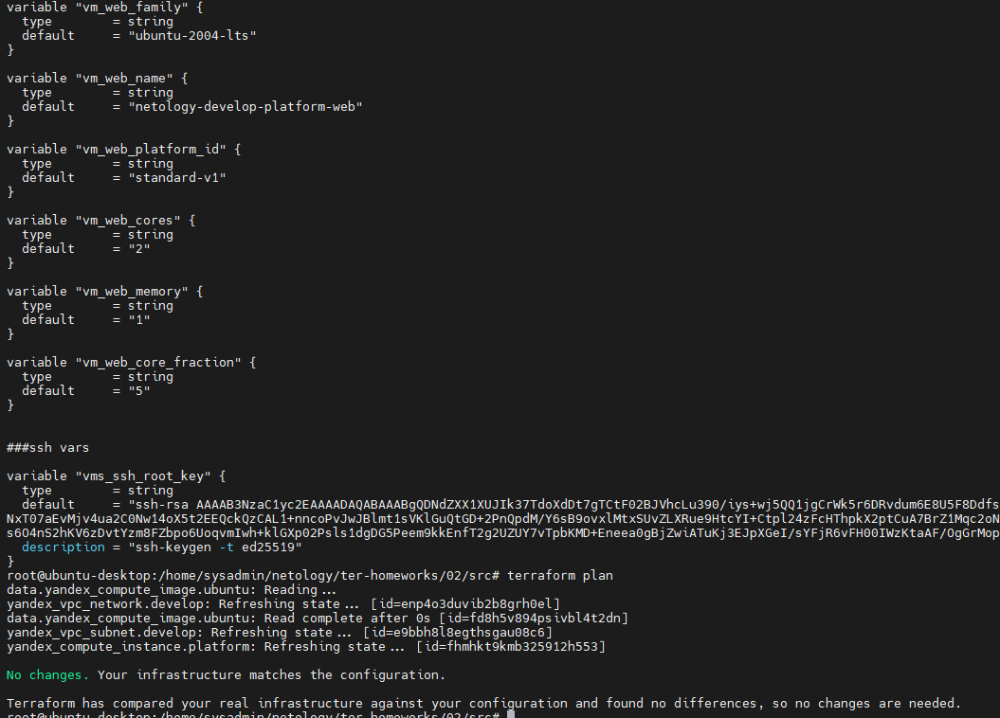

# Домашнее задание к занятию «Основы Terraform. Yandex Cloud»

### Задание 1

1. Изучите проект. В файле variables.tf объявлены переменные для Yandex provider.
2. Переименуйте файл personal.auto.tfvars_example в personal.auto.tfvars. Заполните переменные: идентификаторы облака, токен доступа. Благодаря .gitignore этот файл не попадёт в публичный репозиторий. **Вы можете выбрать иной способ безопасно передать секретные данные в terraform.**
3. Сгенерируйте или используйте свой текущий ssh-ключ. Запишите его открытую часть в переменную **vms_ssh_root_key**.
4. Инициализируйте проект, выполните код. Исправьте намеренно допущенные синтаксические ошибки. Ищите внимательно, посимвольно. Ответьте, в чём заключается их суть.
5. Ответьте, как в процессе обучения могут пригодиться параметры `preemptible = true` и `core_fraction=5` в параметрах ВМ. Ответ в документации Yandex Cloud.

В качестве решения приложите:

- скриншот ЛК Yandex Cloud с созданной ВМ;

## Screen1 

- скриншот успешного подключения к консоли ВМ через ssh. К OS ubuntu необходимо подключаться под пользователем ubuntu: "ssh
  ubuntu@vm_ip_address";

## Screen2 

- ответы на вопросы.

Суть допущенных ошибок скорее всего чтобы мы зашли в документацию и ознакомились разновидностью платформ на которых можно поднять вм, посмотрели возможные значения ресурсов у создаваемых вм.
Параметр "preemptible=true" позволяет создавать виртуальные машины, которые могут быть принудительно остановлены в любой момент. Это может произойти в двух случаях:

- Если с момента запуска виртуальной машины прошло 24 часа.
- Если возникнет нехватка ресурсов для запуска обычной виртуальной машины в той же зоне доступности. Вероятность такого события низкая, но может меняться изо дня в день.

Параметр "corefraction=5" указывает, что виртуальная машина будет использовать только 5% ресурсов процессора на каждом физическом ядре. Данный параметр может быть полезен при обучении больших моделей, когда есть необходимость запустить множество экземпляров моделей на одной физической машине.

    Данные параметры виртуальной машины делают её доступной по более низкой цене в сравнении с обычными, однако не обеспечивают отказоустойчивости.

### Задание 2

1. Изучите файлы проекта.
2. Замените все хардкод-**значения** для ресурсов **yandex_compute_image** и **yandex_compute_instance** на **отдельные** переменные. К названиям переменных ВМ добавьте в начало префикс **vm*web*** . Пример: **vm_web_name**.
3. Объявите нужные переменные в файле variables.tf, обязательно указывайте тип переменной. Заполните их **default** прежними значениями из main.tf.
4. Проверьте terraform plan. Изменений быть не должно.

## Screen3 

### Задание 3

1. Создайте в корне проекта файл 'vms_platform.tf' . Перенесите в него все переменные первой ВМ.
2. Скопируйте блок ресурса и создайте с его помощью вторую ВМ в файле main.tf: **"netology-develop-platform-db"** , cores = 2, memory = 2, core*fraction = 20. Объявите её переменные с префиксом \*\*vm_db*\*\* в том же файле ('vms_platform.tf').
3. Примените изменения.

### Задание 4

1. Объявите в файле outputs.tf output типа map, содержащий { instance_name = external_ip } для каждой из ВМ.
2. Примените изменения.

В качестве решения приложите вывод значений ip-адресов команды `terraform output`.

## Screen4 

### Задание 5

1. В файле locals.tf опишите в **одном** local-блоке имя каждой ВМ, используйте интерполяцию ${..} с несколькими переменными по примеру из лекции.
2. Замените переменные с именами ВМ из файла variables.tf на созданные вами local-переменные.
3. Примените изменения.

## Screen5 

### Задание 6

1. Вместо использования трёх переменных "..\_cores","..\_memory","..\_core_fraction" в блоке resources {...}, объедините их в переменные типа **map** с именами "vm_web_resources" и "vm_db_resources". В качестве продвинутой практики попробуйте создать одну map-переменную **vms_resources** и уже внутри неё конфиги обеих ВМ — вложенный map.
2. Также поступите с блоком **metadata {serial-port-enable, ssh-keys}**, эта переменная должна быть общая для всех ваших ВМ.
3. Найдите и удалите все более не используемые переменные проекта.
4. Проверьте terraform plan. Изменений быть не должно.

---
