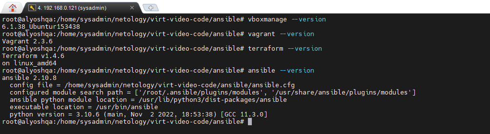
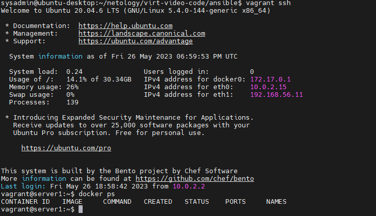

# Домашнее задание к занятию 2. «Применение принципов IaaC в работе с виртуальными машинами»

## Вопрос 1

- Опишите основные преимущества применения на практике IaaC-паттернов.
- Какой из принципов IaaC является основополагающим?

## Ответ 1

- Основные преимущества внедрения инфраструктуры как кода (IaaC) на практике включают:
  1. Оперативность: Использование IaaC-паттернов позволяет автоматизировать процессы развертывания и конфигурации инфраструктуры, что делает их быстрее, эффективнее и менее подверженными ошибкам.
  2. Масштабируемость: IaaC-паттерны облегчают масштабирование инфраструктуры, позволяя быстро развертывать новую инфраструктуру, добавлять и удалять сервисы или микросервисы, менять конфигурацию и развертывать новые релизы.
  3. Гибкость: IaaC-паттерны могут быть легко настроены и адаптированы для работы с любой инфраструктурой и любыми технологиями. Это обеспечивает большую гибкость и эффективность, позволяя достигать более быстрого и точного развертывания и управления ресурсами.
  4. Эффективность: Использование IaaC-паттернов упрощает процессы управления системами, устранения ошибок и резервного копирования данных. Это позволяет сократить время на обслужививание.
- Основополагающим принципом IaaC является автоматизация. Автоматизация позволяет перенести процессы создания, управления и обслуживания инфраструктуры на более высокий уровень доступности и меньшей долей риска ошибок, позволяющий достичь масштабируемости и устойчивости. Все части инфраструктуры должны быть описаны в коде, чтобы их развертывание и управление было автоматизировано.

## Вопрос 2

- Чем Ansible выгодно отличается от других систем управление конфигурациями?
- Какой, на ваш взгляд, метод работы систем конфигурации более надёжный — push или pull?

## Ответ 2

- Ansible выгодно отличается от других систем управления конфигурацией (например, Puppet, Chef, Salt) как минимум по нескольким причинам:
  1. Простота - Ansible очень прост в использовании и обладает относительно небольшим набором команд, что позволяет ускорить время обучения.
  2. Ansible не требует установки на управляемые хосты дополнительных агентов или демонов, что упрощает настройку и установку, а также уменьшает нагрузку на систему.
  3. Однородность - В Ansible существует единая структура для описания задач, что позволяет стандартизировать и упростить управление конфигурацией.
  4. Изменяемость - Ansible позволяет легко изменять и добавлять новые задачи, а также создавать свои собственные плагины и модули.
  5. Широкие возможности - Ansible поддерживает широкий диапазон операционных систем и технологий, включая многие облака, контейнерные платформы и сетевые устройства.

## Задача 3

Установите на личный компьютер:

- [VirtualBox](https://www.virtualbox.org/),
- [Vagrant](https://github.com/netology-code/devops-materials),
- [Terraform](https://github.com/netology-code/devops-materials/blob/master/README.md),
- Ansible.

## Ответ 3

Screen1 

## Задача 4

Воспроизведите практическую часть лекции самостоятельно.

- Создайте виртуальную машину.
- Зайдите внутрь ВМ, убедитесь, что Docker установлен с помощью команды

```
docker ps
```

## Ответ 4

Screen2 
