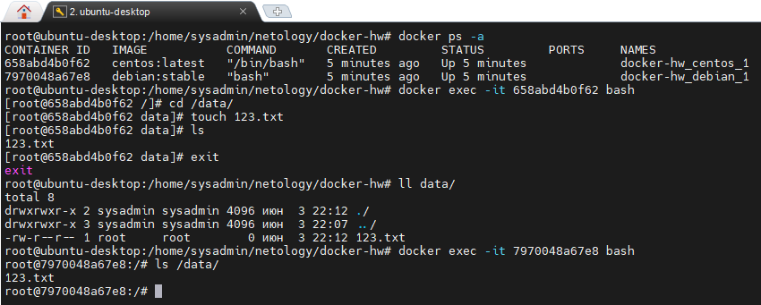

# Домашнее задание к занятию 3. «Введение. Экосистема. Архитектура. Жизненный цикл Docker-контейнера»

## Задача 1

Сценарий выполнения задачи:

- создайте свой репозиторий на https://hub.docker.com;
- выберите любой образ, который содержит веб-сервер Nginx;
- создайте свой fork образа;
- реализуйте функциональность:
  запуск веб-сервера в фоне с индекс-страницей, содержащей HTML-код ниже:

```
<html>
<head>
Hey, Netology
</head>
<body>
<h1>I’m DevOps Engineer!</h1>
</body>
</html>
```

Опубликуйте созданный fork в своём репозитории и предоставьте ответ в виде ссылки на https://hub.docker.com/username_repo.

## Решение 1

https://hub.docker.com/r/a1yoshqa/my-hw-nginx/tags

## Задача 2

Посмотрите на сценарий ниже и ответьте на вопрос:
«Подходит ли в этом сценарии использование Docker-контейнеров или лучше подойдёт виртуальная машина, физическая машина? Может быть, возможны разные варианты?»

Детально опишите и обоснуйте свой выбор.

--

Сценарий:

- высоконагруженное монолитное Java веб-приложение;
- Nodejs веб-приложение;
- мобильное приложение c версиями для Android и iOS;
- шина данных на базе Apache Kafka;
- Elasticsearch-кластер для реализации логирования продуктивного веб-приложения — три ноды elasticsearch, два logstash и две ноды kibana;
- мониторинг-стек на базе Prometheus и Grafana;
- MongoDB как основное хранилище данных для Java-приложения;
- Gitlab-сервер для реализации CI/CD-процессов и приватный (закрытый) Docker Registry.

## Решение 2

В данном сценарии наиболее подходящим вариантом является использование Docker-контейнеров для каждой из указанных систем и приложений. Docker позволяет эффективно и гибко управлять различными сервисами внутри контейнеров, обеспечивая изоляцию и легкую масштабируемость.

Для Elasticsearch-кластера возможно использование Docker для каждой ноды, logstash и kibana, тем самым обеспечив возможность масштабирования и балансировки нагрузки между нодами.

MongoDB также может быть запущена в Docker-контейнере, что обеспечит простоту управления и масштабируемость.

Шина данных на базе Apache Kafka также может быть развернута внутри отдельных контейнеров, обеспечивая изоляцию и гибкость.

Для мониторинга стека на базе Prometheus и Grafana также можно использовать Docker-контейнеры.

Гитлаб-сервер для реализации CI/CD-процессов и приватный (закрытый) Docker Registry также могут быть развернуты в Docker-контейнерах, что обеспечит гибкость и изоляцию.

Таким образом, использование Docker-контейнеров позволит упростить управление инфраструктурой, повысить масштабируемость и гибкость системы. Однако, возможны и другие варианты, например, использование виртуальных машин, физических машин и т.д., но их применение может быть менее эффективным с точки зрения управления и масштабирования инфраструктуры.

## Задача 3

- Запустите первый контейнер из образа **_centos_** c любым тегом в фоновом режиме, подключив папку `/data` из текущей рабочей директории на хостовой машине в `/data` контейнера.
- Запустите второй контейнер из образа **_debian_** в фоновом режиме, подключив папку `/data` из текущей рабочей директории на хостовой машине в `/data` контейнера.
- Подключитесь к первому контейнеру с помощью `docker exec` и создайте текстовый файл любого содержания в `/data`.
- Добавьте ещё один файл в папку `/data` на хостовой машине.
- Подключитесь во второй контейнер и отобразите листинг и содержание файлов в `/data` контейнера.

## Решение 3

Screen1 

## Задача 4 (\*)

Воспроизведите практическую часть лекции самостоятельно.

Соберите Docker-образ с Ansible, загрузите на Docker Hub и пришлите ссылку вместе с остальными ответами к задачам.

## Решение 4

https://hub.docker.com/r/a1yoshqa/my-hw-ansible/tags
