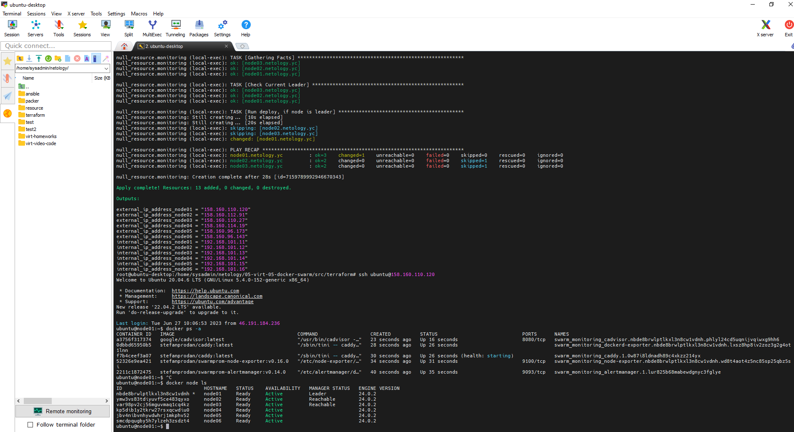
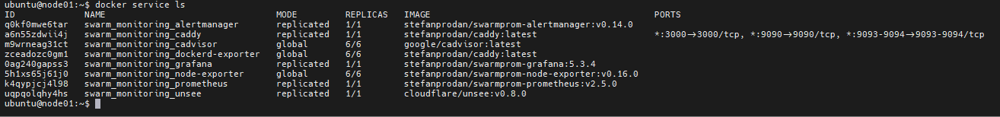

# Домашнее задание к занятию 5. «Оркестрация кластером Docker контейнеров на примере Docker Swarm»

## Задача 1

Дайте письменые ответы на вопросы:

1. В чём отличие режимов работы сервисов в Docker Swarm-кластере: replication и global?
2. Какой алгоритм выбора лидера используется в Docker Swarm-кластере?
3. Что такое Overlay Network?

## Ответ 1

1. Режим работы сервиса в Docker Swarm-кластере с репликацией **replication** означает, что определенное количество экземпляров сервиса будет запущено на разных узлах кластера, но не обязательно на каждом узле. Количество экземпляров определяется параметром replicas в файле конфигурации сервиса или в команде создания сервиса. Режим работы сервиса **global** означает, что на каждом узле кластера будет запущен по одному экземпляру данного сервиса. Если добавить новый узел в кластер, тогда на нем тоже будет запущен экземпляр сервиса.

2. Алгоритм выбора лидера определяется в зависимости от используемого режима планирования **(т.е. Swarm в режиме Classic или Swarm в режиме Orchestrator)**.
   В Swarm в режиме **Classic** лидером становится узел с наивысшим приоритетом (изначально все узлы имеют приоритет 1). При отказе лидера, выбирается новый лидер среди оставшихся узлов. В Swarm в режиме **Orchestrator** лидером становится узел, назначенный ролью manager. Если текущий лидер выходит из строя, то выбирается новый лидер из узлов с ролью manager.

3. Overlay Network – это виртуальная сеть, которая позволяет связывать контейнеры, работающие на разных узлах кластера Docker Swarm. Эта сеть может использоваться как для внутреннего обмена данными между контейнерами, так и для связи с внешними сетями. Каждый узел кластера подключается к Overlay Network, тем самым позволяя контейнерам, запущенным на этом узле, общаться с контейнерами на других узлах. Оверлейная сеть может быть создана с использованием инструмента Docker network.

## Задача 2

Создайте ваш первый Docker Swarm-кластер в Яндекс Облаке.

Чтобы получить зачёт, предоставьте скриншот из терминала (консоли) с выводом команды:

```
docker node ls
```

## Ответ 2

Screen1 

## Задача 3

Создайте ваш первый, готовый к боевой эксплуатации кластер мониторинга, состоящий из стека микросервисов.

Чтобы получить зачёт, предоставьте скриншот из терминала (консоли), с выводом команды:

```
docker service ls
```

## Ответ 3

Screen2 

## Задача 4 (\*)

Выполните на лидере Docker Swarm-кластера команду, указанную ниже, и дайте письменное описание её функционала — что она делает и зачем нужна:

```
# см.документацию: https://docs.docker.com/engine/swarm/swarm_manager_locking/
docker swarm update --autolock=true
```

## Ответ 4

Команда docker swarm update --autolock=true включает опцию автоматической блокировки узлов в кластере Swarm. Эта опция обеспечивает защиту от случайного удаления узлов из кластера. Если эта опция включена, то при каждом изменении конфигурации кластера Swarm, например, при добавлении новых сервисов, Docker автоматически блокирует узлы, чтобы предотвратить нежелательные изменения в кластере. Заблокированные узлы могут быть разблокированы только с помощью команды docker swarm unlock. + генерируется ключ (токен) который будет необходим для разблокировки кластера, так что необходимо его сохранить.
